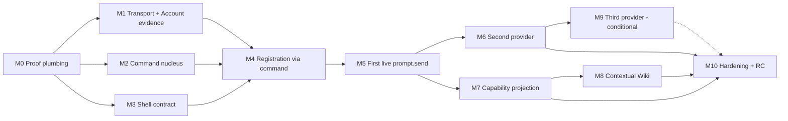

# First Product Release — Build Roadmap

Target: `seed-docs/FIRST-PRODUCT-RELEASE-DESIGN.md` (owner-selected 2026-10-05).

> A small floating Windows command box through which a person registers their
> Provider Accounts, sees the capabilities those relationships make available,
> and uses them in natural language through a deterministic semantic command
> system. First external capability: `prompt.send`.

The release proves one chain end to end:

**human language → explicit deterministic command → governed realization →
observed external result → durable local continuity**

This roadmap is a learning sequence (design §25), re-ranked at every milestone
exit. It never lowers the proof standard to hit a date.

---

## 1. Current position (evidence, 2026-10-05)

| Area | State | Evidence |
| --- | --- | --- |
| Host, law, Vault, local continuity | **verified-local** | `omega:quick` 62/62 (Windows Bun 1.4.2, bootstrap.json); reproduced 62/62 on Linux Bun 1.3.14 in this review |
| Deterministic language core (nlcl-pure, mind, intent, director) | **verified-local, wrong domain** | Suites pass (nlcl 31, mind 41, intent 24, director 38). Frames, entities and recognizers target the email console, not Provider Accounts |
| Release command fit | **partially proven by spike** | Seed corpus: precedence, ambiguity preservation, unknown-target refusal, consent gate projection and N1 replay already hold; addressee paraphrases, registration, orientation fail; one validator-relevant defect (U1) |
| Provider registry / realization lifecycle | **verified-local, no Account** | providers 6/6, discovery-verification 25/25; no Account concept in contracts or plugins; `providers.session.start` is a stub |
| Browser transport | **fixture only** | provider-browser requires `sim:true` and absent fixtures; no live CDP/extension path |
| Account identity | **unknown** | No observation yet; the immediate blocker per SITREP |
| Web API (`/api/interpret`, `/execute`, `/consent`) | **partial, unsafe** | web 22/22; root calls without auth/origin restriction |
| Shell, packaging, installer | **absent** | — |
| Broad suite / historical gates | **blocked** | Missing tooling/fixtures; kept visible, not part of release proof |

Details and dispositions: [BASELINE-HARVEST-ASSAY.md](BASELINE-HARVEST-ASSAY.md).

**Key implication.** The command nucleus is not a greenfield build: the
baseline already has a pure, traced, deterministic interpreter with grounding,
ambiguity, suggestions, a visual-projection type and consent-aware effect
previews. The release work there is *adaptation* (frames as data, addressee
grammar, account entities, validator, registry). The genuinely unknown,
release-gating seam is **real browser transport + Account identity**, which is
why M1 starts immediately and sits on the critical path.

---

## 2. Milestones and exit gates

Mapping to design §25: A→M2, B→M3, C→M1, D→M4, E→M5, F→M6, G→M7, H→M8, I→M10.
M0 and M9 are added (proof plumbing; conditional third provider).

**Critical path:** M1 → M4 → M5 → M6 → M10. M2 and M3 run in parallel with M1
and must be ready when M1 exits.

### M0 — Roadmap adoption & proof plumbing
- **Goal:** make every later claim recordable and every regression visible.
- **Tasks:** OPS-01…04, TRU-01, TRU-02, TRU-03, TRU-06, TRU-07.
- **Exit gate:** release.json exists with all §23/§24 claims `unproven`;
  `omega:semantic` lane green on Windows; F1–F10 skeleton runs; Commons rows live.

### M1 — Transport & Account evidence (read-only) — *critical path*
- **Goal:** prove a real browser path to provider 1 and what identifies the
  logged-in Account, without submitting anything.
- **Tasks:** PRV-01…05, TRU-05.
- **Exit gate:** RD-1 decided; manual-live metadata observation recorded;
  account-switch, logout, browser-closed and stale falsifiers pass live;
  identity evidence shape with redaction rule (RD-3 proposal).
- **Kill/redirect trigger:** if no transport is attachable without unacceptable
  permissions, run the Release Gym immediately (alternatives: extension-only
  path, owner-launched dedicated profile, or reframing provider support) — do
  not proceed to M4 on simulated transport.

### M2 — Command nucleus (design §25-A)
- **Goal:** the smallest canonical USE representation and deterministic
  resolver sufficient for setup, help and `prompt.send`, reachable headless.
- **Tasks:** CMD-01…09, REG-01, REG-03, REG-05, GOV-01, GOV-02, HLP-03, TRU-04.
- **Exit gate:** corpus ≥60 cases with all §16 categories; P1/P3/P4/P5/U1/O1/O2/G1
  promoted; CLI `interpret`/`use` drives draft → validate → law check on the
  release composition with a stub realization clearly labelled `fixture`;
  command registry is the only state-changing path (F2 harness input ready).

### M3 — Floating shell contract (design §25-B, mocked state)
- **Goal:** prove the interaction contract on Windows before real providers.
- **Tasks:** SHL-01…05, GOV-06, GOV-07, REL-02.
- **Exit gate:** hotkey summon/dismiss, compact/expanded box rendering only
  VisualSpec; every element emits a registry command (F2 green for current
  surface); typed vs clicked parity for ≥5 actions; web/host channel
  authenticated and loopback-only; packaged-host spike boots (RD-9 risk retired
  or escalated).

### M4 — Registration through command, provider 1 (design §25-D)
- **Goal:** "add my ChatGPT account" travels the same command machinery and
  persists a truthful Account relationship.
- **Tasks:** REG-02, REG-06, REG-07, REG-08, PRV-06, PRV-12, CMD-10, REL-01.
- **Exit gate:** typed registration and the equivalent button produce the same
  command digest; Account record carries identity evidence; restart keeps the
  relationship and shows capability state stale until revalidated; two Accounts
  of one provider cannot be confused (RD-2 decided, F4 live).

### M5 — First live `prompt.send` (design §25-E)
- **Goal:** one real prompt through one real Account with explicit external
  evidence.
- **Tasks:** PRV-07, PRV-08, GOV-03, GOV-04, GOV-05, GOV-08, CMD-12, SHL-06.
- **Exit gate:** automated-live receipt bound to the selected Account; consent
  required and not mintable by NL; kill mid-execution ⇒ `uncertain`, never
  success; disconnected/stale binding refuses before submission (F6, F10 green
  for provider 1); differential vs manual send recorded.

### M6 — Second provider falsification (design §25-F)
- **Goal:** Claude Web challenges every shared boundary.
- **Tasks:** PRV-09, TRU-09.
- **Exit gate:** live `prompt.send` with account evidence on provider 2;
  abstraction-change ledger reviewed; F8 evaluated with evidence. If shared
  semantics needed parallel architecture, stop and redesign before M10.

### M7 — Capability projection & availability truth (design §25-G)
- **Goal:** the UI is a projection of real capability state.
- **Tasks:** REG-04, PRV-10, SHL-07, HLP-05.
- **Exit gate:** every availability state reachable in tests and mapped to a
  resolving command; drift injection yields `drifted`, not success; empty
  registry shows no capability chips (F5 green).

### M8 — Contextual Wiki (design §25-H)
- **Goal:** help derived from the same registry and state.
- **Tasks:** HLP-01, HLP-02, HLP-04, CMD-13, CMD-11 (conditional).
- **Exit gate:** F7 green under registry mutation; "what can I do?" changes with
  state; RD-4 follow-up decided from real-phrasing coverage.

### M9 — Third provider (conditional)
- **Tasks:** PRV-11. Built only if the M6 Gym cycle shows Gemini materially
  increases confidence. Provider count is secondary to correctness (§18).

### M10 — Release hardening & release candidate (design §25-I)
- **Tasks:** REL-03…07, SHL-08, TRU-08.
- **Exit gate:** every §23 claim at its required evidence level; F1–F10 green;
  §27 journey completed by ≥2 ordinary users on clean machines; honest
  per-provider support statement published.

---

## 3. Parallel tracks (who can work at once)

| Track | Milestones | Isolation (OPS-02) | Best-fit executor profile |
| --- | --- | --- | --- |
| A · Provider Lab | M1 → M4 → M5 → M6 → M7 | new provider-webapp plugin + lab dir | Needs owner machine, Chrome, live accounts; human-in-loop for live runs |
| B · Language core | M2 → M4 (CMD-10) → M8 | `plugins/vivim-nlcl*`, new command module | Fully offline; ideal for parallel model lanes with corpus as referee |
| C · Shell | M3 → M5 (SHL-06) → M7 | new shell dir | Windows desktop; framework spike first |
| D · State & authority | M2 (REG/GOV) → M4 → M5 | providers plugin, new registry ns, compositions | Offline until M5 |
| E · Truth | continuous | evidence/ + test files only | Must differ from the implementer of the reviewed change |

Tracks B and D are offline and corpus/test-refereed — the natural place to fan
out across the five model lanes once OPS-03 verifies them.

---

## 4. Open decisions (resolve with evidence, record in DECISIONS.md)

| ID | Decision | Resolved by | Default if unresolved |
| --- | --- | --- | --- |
| RD-1 | Browser transport: CDP into dedicated profile vs MV3 extension + chrome.debugger vs extension + native messaging | PRV-02/03 | None — M4 blocked |
| RD-2 | Account ↔ browser-profile mapping for multiple Accounts of one provider | PRV-12 | One VIVIM profile per Account |
| RD-3 | Sufficient Account identity evidence per provider | PRV-04/05 | Refuse consequential ops when below threshold |
| RD-4 | Interpreter strategy: deterministic-first with optional model edge vs model-proposal-first | CMD-01, CMD-13 | Deterministic-first (baseline already strong) |
| RD-5 | Frames as capability-contributed data vs compiled constants | CMD-03 | Data (needed for second provider and help) |
| RD-6 | Shell framework | SHL-01 | — |
| RD-7 | Shell ↔ host channel and principal | SHL-05, GOV-07 | Loopback + per-install token, user principal |
| RD-8 | Prompt/response content retention | **Owner product decision** (GOV-05) | Structural receipts only |
| RD-9 | Packaging runtime (bundled Bun vs compiled binary) | REL-02 | — |
| RD-10 | Consent scope for `prompt.send` (per send vs standing per Account) | GOV-03 | Per send until owner chooses standing |
| RD-11 | Reuse `vivim.intent` four-state rows for command drafts vs lighter session store | CMD-01/CMD-09 | Reuse PendingIntent shape, lighter store |

## 5. Risk register

| ID | Risk | Signal | Mitigation / owner |
| --- | --- | --- | --- |
| R-1 | No attachable transport without extension install (Chrome 136+ blocks remote debugging on default profile) | PRV-01 | Extension or dedicated-profile path; Gym re-rank (PRV) |
| R-2 | Provider terms of service or automation detection constrain web-UI automation | PRV-02 findings | **Escalate to owner** as legal/product-authority question before M5; keep human-initiated, user-owned-session framing explicit |
| R-3 | Account identity not observable without capturing personal content | PRV-04 | Digest + user label; refuse when insufficient (RD-3) |
| R-4 | Deterministic grammar brittle on real phrasing | Corpus pass rate | Frames-as-data, corpus growth, conditional model edge (CMD-11) |
| R-5 | Worker-thread plugins/SQLite fail in packaged Windows form | REL-02 | Early spike at M3, not M10 |
| R-6 | Open web API trust boundary reused by shell | GOV-06 | Fix before SHL-05 |
| R-7 | Provider DOM drift during development | PRV-10 | Drift fingerprint; packs isolate quirks |
| R-8 | Lab mirror UI creeping into product | Review | Design §19: harvest knowledge, not Lab UI |
| R-9 | Executor lanes unverified ⇒ throughput assumptions wrong | OPS-03 | Verify before fan-out |
| R-10 | Broad-suite failures mask regressions | TRU-02 | Named lanes with explicit exclusions |
| R-11 | Duplicate external effect after crash | GOV-04 | Attempt record + `uncertain` + no blind retry |
| R-12 | Multiple-account UX friction (profile juggling) | PRV-12 | Measure; smallest resolving action UX |

## 6. Explicitly out of scope (design §21)

Agent autonomy, background Work, Canvas/spatial UI, Lab semantic mirrors,
attachments, provider projects, fan-out to many providers, automatic repair
without review, Forge, 3D UI, workflow orchestration, large settings app,
personal knowledge graph, AI-API execution leg (PRODUCT-ANCHOR V1 boundary).
Adding any of these requires a Gym entry citing a real release blocker.

## 7. Re-ranking triggers

Run the Release Gym out of cycle when: a milestone kill trigger fires; a
falsifier that was green turns red; a second provider requires shared-semantics
change; an owner decision (RD-8, R-2) lands; or measured effort on a task
exceeds 2× its size class.
